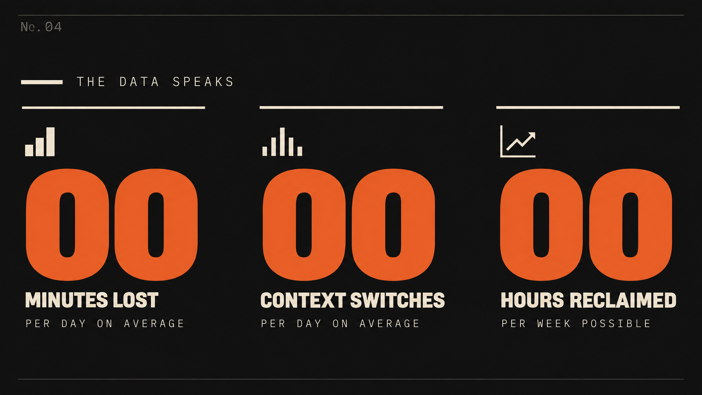

# MAV-MG

[中文](README.md) · **English** · [Download the public Skill](https://github.com/maverickgao8848/mav-mg/releases/download/v0.1.0-preview.18/mav-mg-0.1.0-preview.18.zip) · [Download the original video](https://github.com/maverickgao8848/mav-mg/releases/download/v0.1.0-preview.18/bank-run-v3-music.mp4) · [Skill entry](SKILL.md)

**Turn Chinese narration into editable educational motion graphics.** Plan the teaching beats, choose a visual direction, demonstrate each mechanism on screen, and build a HyperFrames project for preview and rendering.

https://github.com/user-attachments/assets/257d441e-305a-428f-a1b9-2fbf370635a9

**Sample video:** *Bank Run* v3 with music, 70.7 seconds at 1920×1080 and 30 fps. Play it directly on this page; use the link above to download the original.

## Choose a style visually

These are HyperFrames preview frames and style reference images. **Cobalt Grid and Editorial Forest are included in the public package. The other four are previews only; their applicable style specifications and resource packs are not included.** Click either public image to read its `FRAME.md`. The display images show visual direction, not promised output or factual content for a new topic.

<table>
<tr>
<td width="50%"><a href="assets/styles/cobalt-grid/FRAME.md"></a><br><b>Cobalt Grid · Included</b><br>Research, data and systems<br><code>cobalt-grid</code></td>
<td width="50%"><a href="assets/styles/editorial-forest/FRAME.md"></a><br><b>Editorial Forest · Included</b><br>Nature, materials and everyday science<br><code>editorial-forest</code></td>
</tr>
<tr>
<td width="50%"><br><b>Open Code · Preview</b><br>Software and digital mechanisms</td>
<td width="50%"><br><b>Gable & Reed · Preview</b><br>Engineering and structural explanation</td>
</tr>
<tr>
<td width="50%"><br><b>Dell 1996 · Preview</b><br>Retro technology and internet culture</td>
<td width="50%"><br><b>Broadside · Preview</b><br>Poster scale type and emphatic ideas</td>
</tr>
</table>

A future paid package is planned to include the complete style collection and a step-by-step usage guide. Sales are not open yet.

## Get started

1. Download and unzip the package. Put `mav-mg` in `~/.codex/skills/` or your project's `.agents/skills/`.
2. Install Node.js and HyperFrames. We recommend **`gpt-6-sol` or a more capable GPT-6 model**. Advanced mode also requires the runtime model check in the [input contract](references/input-contract.md). Voice generation additionally needs the voice tool selected for your project.
3. In Codex, provide Chinese narration or timed cues and state your target duration and style:

```text
Use mav-mg to make this Chinese narration into educational MG.
Choose cobalt-grid and standard mode.
Confirm the teaching beats and storyboard, then build an editable HyperFrames project.
```

From the Skill directory, apply an included style:

```powershell
node scripts/apply-style.mjs --style cobalt-grid --project <project-directory>
```

`editorial-forest` is also accepted. The tool checks resource hashes, writes the project `frame.md`, and copies paired references. Reconcile a conflicting existing project style before continuing.

## Technical preview boundary

This package targets **Chinese educational explainers at 1920×1080 and 30 fps**. It accepts plain narration, fixed cues and reference cues, and produces an editable, seek-safe HyperFrames project. Advanced mode has a model prerequisite in the [input contract](references/input-contract.md). The [release scope](references/release-scope.md) records validated lengths and known visual limitations. Review each new project through real preview frames and normal-speed playback.

## License and commercial use

Repository code and public resources are provided under the [PolyForm Noncommercial License 1.0.0](LICENSE). Commercial use requires separate authorization. Check each asset's metadata for its own provenance and rights. Future paid-package terms will be stated when it is released.
