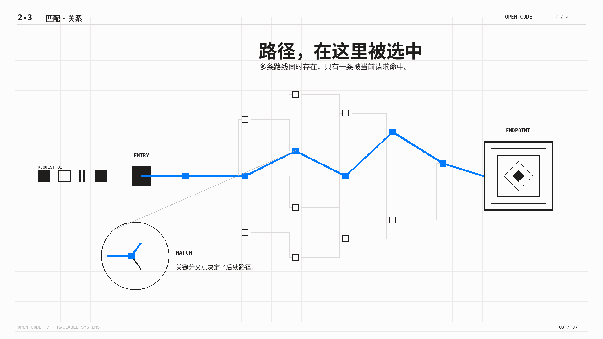

# MAV-MG

**中文** · [English](README.en.md) · [下载免费公开版 Skill](https://github.com/maverickgao8848/mav-mg/releases/download/v0.1.0-preview.21/mav-mg-0.1.0-preview.21.zip) · [下载原版视频](https://github.com/maverickgao8848/mav-mg/releases/download/v0.1.0-preview.18/bank-run-v3-music.mp4) · [Skill 入口](SKILL.md)

**把中文讲解文稿变成可编辑的知识型 MG 动画。** 从文稿梳理教学重点，选择视觉风格，制作逐句可见的机制演示，最终交给 HyperFrames 预览与渲染。

https://github.com/user-attachments/assets/257d441e-305a-428f-a1b9-2fbf370635a9

**样例视频：**《银行挤兑》v3 音乐版，70.7 秒，1920×1080、30 fps。可在此页直接播放；顶部链接可下载原版。

## 直接看图选风格

以下是实际 HyperFrames 预览帧与风格参考图。**免费公开版只包含 Cobalt Grid 和 Editorial Forest 两套可应用风格。** 点击这两张图片可查看完整 `FRAME.md`。Open Code、Gable & Reed、Dell 1996 与 Broadside 为付费风格，这里只展示从高级模式参考图中选取的封面；它们的风格规范和参考素材不包含在公开仓库或下载包中。展示图用于辨认视觉方向，不代表新主题的生成结果或事实内容。

<table>
<tr>
<td width="50%"><a href="assets/styles/cobalt-grid/FRAME.md"></a><br><b>Cobalt Grid · 公开可用</b><br>研究、数据、系统解释<br><code>cobalt-grid</code></td>
<td width="50%"><a href="assets/styles/editorial-forest/FRAME.md"></a><br><b>Editorial Forest · 公开可用</b><br>自然、材料、生活科学<br><code>editorial-forest</code></td>
</tr>
<tr>
<td width="50%"><br><b>Open Code · 付费版展示</b><br>终端、软件、数字机制</td>
<td width="50%"><br><b>Gable & Reed · 付费版展示</b><br>工程、结构、技术图解</td>
</tr>
<tr>
<td width="50%"><br><b>Dell 1996 · 付费版展示</b><br>复古科技、索引、互联网文化</td>
<td width="50%"><br><b>Broadside · 付费版展示</b><br>强观点、海报、大字节奏</td>
</tr>
</table>

## 开始使用

1. 下载顶部 ZIP 并解压，把 `mav-mg` 文件夹放到 `~/.codex/skills/`，或放到项目的 `.agents/skills/`。
2. 安装 Node.js 和 HyperFrames。推荐使用 **`gpt-6-sol` 或更强的 GPT-6 模型**；`advanced` 模式还须满足[输入契约](references/input-contract.md)中的模型确认要求。若要生成旁白，还需准备项目选用的语音工具。
3. 在 Codex 中提供中文文稿或带时间码的讲解材料，说明目标时长和风格。例如：

```text
用 mav-mg 把这段中文讲解做成知识型 MG。
风格用 cobalt-grid，制作模式用 standard。
先确认教学重点和分镜，再构建可编辑的 HyperFrames 工程。
```

从 Skill 文件夹运行风格应用工具：

```powershell
node scripts/apply-style.mjs --style cobalt-grid --project <项目目录> --mode advanced
```

免费公开版的 `--style` 可选 `cobalt-grid` 或 `editorial-forest`；`--mode` 可选 `standard` 或 `advanced`。Cobalt Grid 的两种模式分别使用各自的七张参考图，Editorial Forest 的两种模式使用同一组参考图。工具会核对资源哈希，将规范写入项目 `frame.md`，并复制所选参考图。已有项目风格发生冲突时，先在项目中确认最终版本。

## 当前支持边界

本包是技术预览版，面向 **1920×1080、30 fps 的中文知识讲解**。支持普通文稿、固定时间码和参考时间码；可生成可编辑、可任意时间定位的 HyperFrames 工程。`advanced` 模式有模型前置条件，详见 [输入契约](references/input-contract.md)。完整支持范围、验证长度和已知质量缺口以 [技术预览边界](references/release-scope.md) 为准。每个新主题仍需按实际预览检查可读性、遮挡和运动节奏。

## 许可与商业使用

本仓库代码和公开资源按 [PolyForm Noncommercial License 1.0.0](LICENSE) 发布。商业用途需要单独授权；素材自身的来源和授权信息请同时查看对应 metadata。
